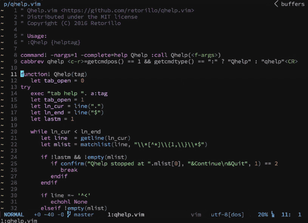

# Qhelp.vim

[](https://opensource.org/licenses/MIT)

Vim plugin to quickly glance help section



## Install (Pathogen)

```vimL
git clone https://github.com/retorillo/qhelp.vim.git ~/.vim/bundle/qhelp.vim
```

## Usage

```vimL
:Qhelp {helptag}
```

## License

Distributed under the MIT license.

Copyright (C) 2016 Retorillo
